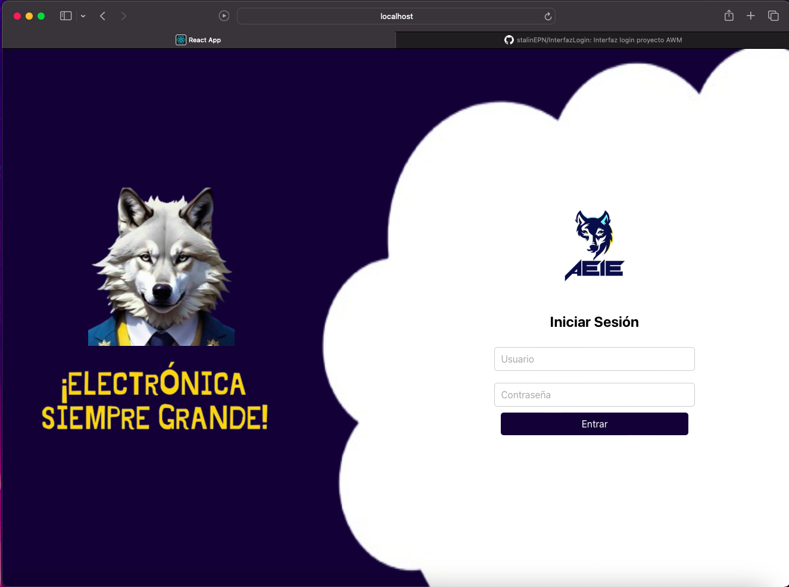

# AEIE Store and More - Interfaz de Login

Este repositorio contiene el código para la interfaz de **Login** del proyecto **AEIE Store and More**, correspondiente a la tarea de la materia **Aplicaciones Web y Móviles**.

## Descripción

Esta interfaz permite a los usuarios iniciar sesión en el sistema de **AEIE Store and More**, proporcionando campos para el ingreso de usuario y contraseña. Representa la primera pantalla de acceso al sistema, diseñada para facilitar el ingreso seguro de los miembros.

## Captura de pantalla

A continuación, una muestra visual de la interfaz:

## Estructura de Componentes

- **App**: Componente principal que incluye la estructura de la página de inicio de sesión.
- **LoginForm**: Componente central que contiene el formulario de inicio de sesión con los campos de usuario y contraseña.

## Tecnologías Utilizadas

- **React**: Para la construcción de la interfaz de usuario.
- **CSS**: Para el diseño y estilo de la interfaz.

## Instrucciones de Uso

1. Clona el repositorio en tu máquina local.
2. Instala las dependencias con `npm install`.
3. Inicia la aplicación con `npm start`.
4. La interfaz de login estará disponible en `http://localhost:3000`.

